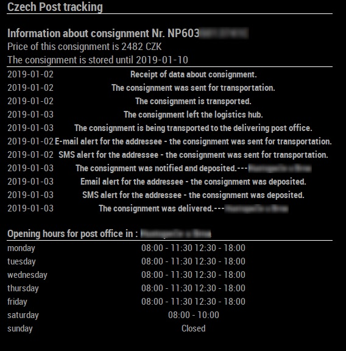

# MMM-CzechPost
MagicMirror2 module for tracking parcels handled by Czech Post



## Installation
Navigate into MagicMirror's Module folder using termial:
```
cd ~/MagicMirror/modules
```
Clone this repository using following command: 
```
git clone https://github.com/RichieCZ/MMM-CzechPost.git
```
Add the following text to ```MagicMirror/config/config.js``` to activate the module.
```
{
    module: "MMM-CzechPost",
    position: "top_left", // You can change this to your desired position.
    config: {
        //Here you can insert options listed below.
        }
},
```

## Configuration Options
| Option  | Description |
| ------------- | ------------- |
| ```packagesUrl```  | Url of a shared Google Docs document. This document is used to pass tracking numbers into this module. For more info see [dependencies](#dependencies) below. <br/> **Type:**```string```<br/> **Default:**```""```<br/> This option is **NOT REQUIRED**   |
| ```postCode```  | Postcode of desired Czech post office. This option works only when no ```packagesUrl``` is set.<br/> **Type:**```string```<br/> **Default:**```"76001"```<br/> This option is **REQUIRED** only when option ```packagesUrl``` is not set.  |
| ```showPostInfo```  | Select how much information about post offices you want to see.<br/> **Type:**```string```<br/> **Default:**```all```<br/>**Possible values:** ```all```,```today```,```none```(if this option is selected without any url in ```packagesUrl``` the module will not display any information).<br/> This option is **NOT REQUIRED**.   |
| ```showPackageInfo```  | Select how much information about inserted packages you want to see.<br/> **Type:**```string```<br/> **Default:**```all```<br/>**Possible values:** ```all```,```latest``` <br/> This option is **NOT REQUIRED**.   |
| ```maxNumOfShownPackages```  | If ```showPackageInfo``` option is set to ```all```, you can choose how many packages will be shown on the screen with this option. If the number of packages is higher, the module will only show latest information about each package.<br/> **Type:**```integer```<br/> **Default:**```1```<br/> This option is **NOT REQUIRED**.   |
| ```tableClass```  | Set the size of tables rendered on screen.<br/> **Type:**```string```<br/> **Default:**```small```<br/>**Possible values:** ```xsmall```,```small```,```medium```,```large```,```xlarge```.<br/> This option is **NOT REQUIRED**. |
| ```initialLoadDelay```  | Delay before loading the module. The value is in milliseconds.<br/> **Type:**```integer```<br/> **Default:**```3000```(3 seconds)<br/>**Possible values:** ```1000```-```5000```.<br/> This option is **NOT REQUIRED**. |
| ```retryDelay```  | The delay before retrying after failed request.<br/> **Type:**```integer```<br/> **Default:**```5000```(5 seconds)<br/>**Possible values:** ```1000```-```60000```.<br/> This option is **NOT REQUIRED**. |
| ```updateInterval```  | Interval after which new content is fetched. This value is in milliseconds.<br/> **Type:**```integer```<br/> **Default:**```5*60*1000```(5 minutes)<br/>**Possible values:** ```1000```-```86400000```.<br/> This option is **NOT REQUIRED** |

## Multiple Instances of the Module
You can run multiple instances of this module. You can do this by adding another entry of this module into ```MagicMirror/config/config.js```.

## Dependencies 
For inserting and changing the tracking numbers in this module, you need to create a new Google Docs document, that is set to public. You can do this by going onto the google docs [website](https://www.google.com/docs/about/) and creating new document. After your document is created, you have to click the Share button and then select the "Everyone can see this" option in the pop-up menu, after that you can copy the generated Url and place it into the config file.

You can find API used in this module [here](https://b2c.cpost.cz/#4.Informace%20o%20poštách|outline).

There is a CORS problem with this API, so in order to make this module work a proxy server is used. The proxy server is available on this [website](https://github.com/Freeboard/thingproxy). There is a limitation of 100000 characters per request and a limitation of 10 requests/second.

## Issues
If you find any issues with this module, feel free to open a GitHub issue in this repository. 
